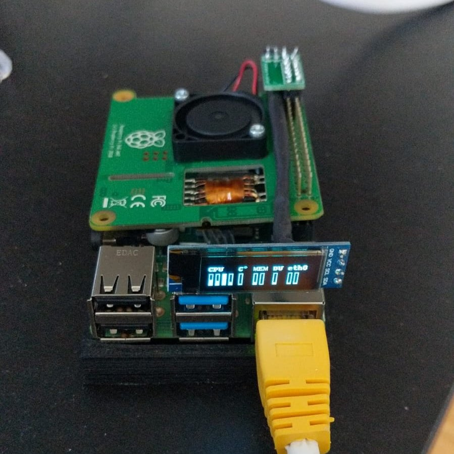
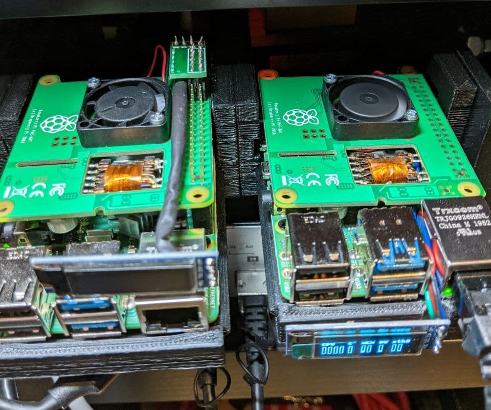

# RPI4 Status Display

A status display for the Raspberry PI 4 but it can actually work on any other board, there aren't strict requirements.

Currently only the **SSD1306** based displays are going to be supported and only the **I2C** protocol is going to be implemented.

This software replaces the rpi4-ssd1306-status-display written in python which can be found at the following address:
https://gist.github.com/danielealbano/32a391b41cbffb447781989b6ea4b32e

Here some reference pictures of the python version in action

Very first version, I designed a small connection board to avoid flying wires but it's not necessary at all.

Below 2 of the PIs of my cluster, on the right the small connection board is not visible as it has been soldered directly
on the Raspberry PI4 to reduce the height and being able to keep the 1U form factor.

 